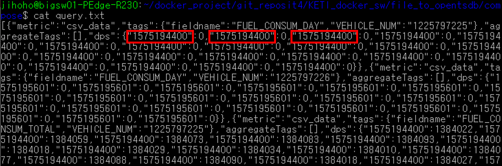
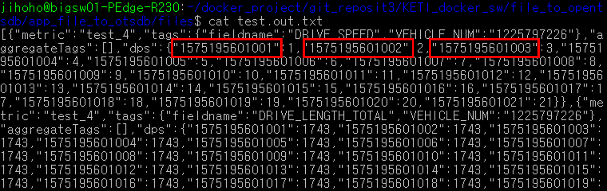
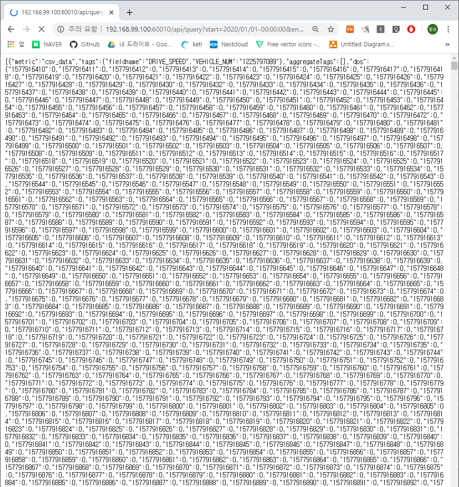
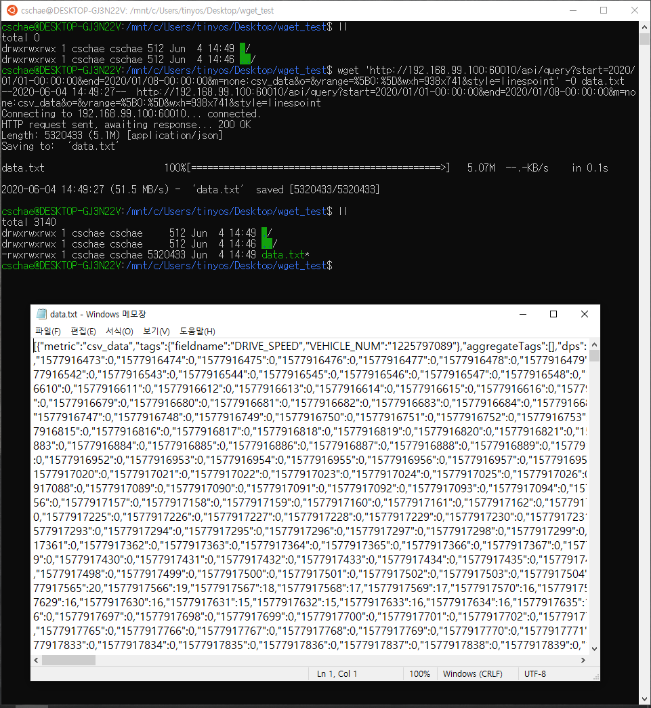
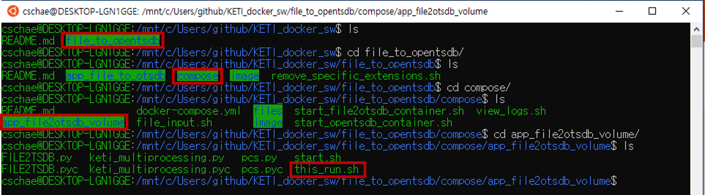
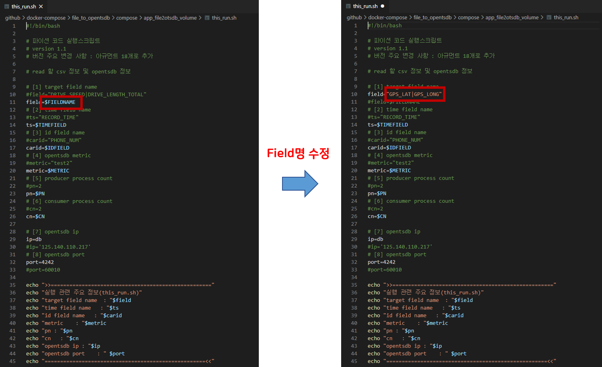
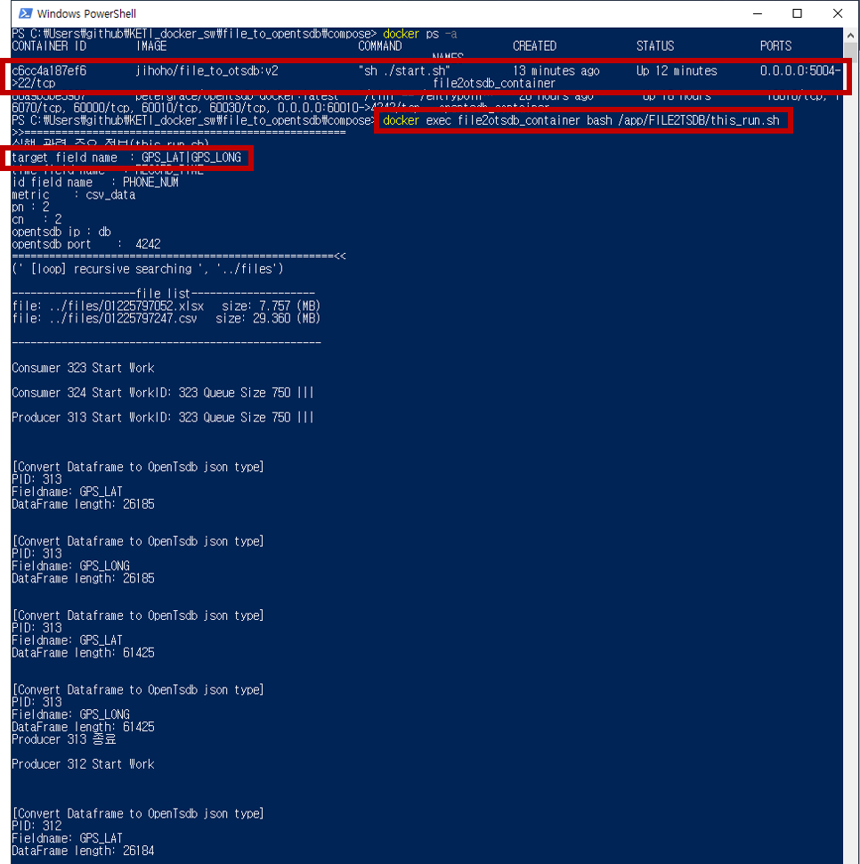
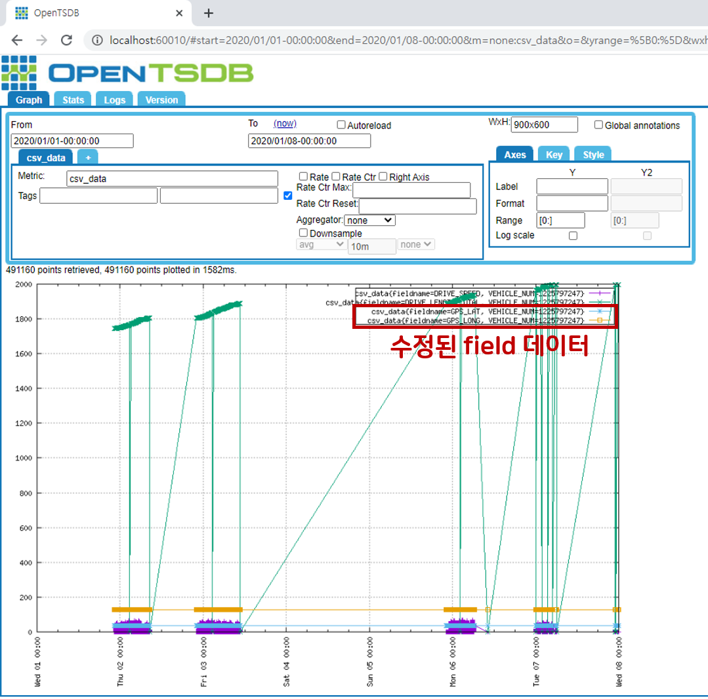

# File_to_opentsdb 리포
#### 개요
- CSV, Excel 원본 측정/수집 데이터를 OpenTSDB 로 전송하여 저장하는 Docker Container 구조의 S/W
- OpenTSDB로 입력하고자 하는 데이터는 (로컬호스트 파일시스템에 위치)  
  - 전송, 저장을 위한 파일은 특정 directory안의 위치시킴
  - csv, excel파일 read하여  docker opentsdb container로 put하는 python software
- 원본 데이터, CSV파일 및 Excel파일을 OPEN TSDB 컨테이너로 전송 및 저장

## file_to_tsdb 전체구조

  - 

## 사전준비

- Docker Desktop 및 docker-compose 실행 가능해야 함

  1.  리눅스/우분투 docker/docker-compose 설치
  
      https://hcnam.tistory.com/25
      
  2. 윈도우
  
     - docker/docker-compose 설치
  
       https://steemit.com/kr/@mystarlight/docker
     
     - 도커 툴박스 설치

       https://github.com/docker/toolbox/releases
  
- csv, 엑셀 파일의 time format 및 openTSDB millisecond timestamp query

  - 초 단위의 경우 

    - YYYY-MM-DD HH:MM:SS    ex) 2020-01-20 10:20:20
    - YYYY-MM-DDTHH:MM:SSZ   ex) 2020-01-20T10:20:20Z

  - millisecond의 경우 

    - YYYY-MM-DD HH:MM:SS.sss  ex) 2020-01-20 10:20:20.001
  - YYYY-MM-DDTHH:MM:SS.sss ex) 2020-01-20T10.20.20.001

  - openTSDB millisecond query
    - query 시 Requests parameter 중 msResolution(or ms )값을 true로 설정하여함

  | Name                      | Data Type | Required | Description                                                  | Default | QS   | RW   | Example |
  | :------------------------ | :-------- | :------- | :----------------------------------------------------------- | :------ | :--- | :--- | :-----: |
  | msResolution<br />(or ms) | Boolean   | Optional | 데이터 포인트 타임 스탬프를 밀리 초 또는 초 단위로 출력할지 여부. msResolution 플래그가 권장됨. 이 플래그가 제공되지 않고 1 초 내에 여러 데이터 포인트가있는 경우 해당 데이터 포인트는 쿼리 집계 함수를 사용하여 다운 샘플링 됨 | false   | ms   |      |  true   |

  [참조 링크]( http://opentsdb.net/docs/build/html/api_http/query/index.html)

  - msResolution(ms) 값을 true로 설정하지 않을 경우(default: false)

    ~~~bash
    $ wget 'http://[ip]:[port]/api/query?start=[데이터 시작날짜]&end=[데이터 끝날짜]:00&m=none:[metric_name]' -O filename.txt
    ~~~

    ~~~bash
    ex) wget 'http://localhost:60010/api/query?start=2019/12/01-00:00:00&end=2019/12/02-00:00:00&m=none:csv_data' -O query.txt 
    ~~~

    - 초 단위의 timestamp인 10자리가 출력이 됨

    

  - msResolution(ms) 값을 true로 설정했을 경우

    ~~~bash
    $ wget 'http://[ip]:[port]/api/query?start=[데이터 시작날짜]&end=[데이터 끝날짜]:00&ms=true&m=none:[metric_name]' -O filename.txt
    ~~~

    ~~~bash
    ex) wget 'http://localhost:60010/api/query?start=2019/12/01-00:00:00&end=2019/12/02-00:00:00&ms=true&m=none:csv_data' -O query.txt 
    ~~~

    - 밀리 초 단위의 timestamp인 13자리가 출력이 됨

    

- 파일 정보 (files디렉토리 하위 파일)
  
    1. ./01225797052.xlsx
       - time format : YYYY-MM-DD HH:MM:SS
       - 기간: 2019/06/02-00:00:00 ~ 2019/06.04-00:00:00
       - number of rows  : 52395
    
  2. ./01225797247.csv
  
     - time format : YYYY-MM-DD HH:MM:SS
  
     - 기간: 2020/01/01-00:00:00 ~ 2020/01.08-00:00:00
  
     - number of rows  : 122849
  
  3. ./millisec_files/01225797225.csv
  
     - time format : YYYY-MM-DDTHH:MM:SS.SSS
  
     - 기간: 2019/12/01-10:00:00.001 ~ 2019/12.01-10:00:00.021
  
     - number of rows  : 21
  
  4. ./millisec_files/01225797226.csv
  
     - time format : YYYY-MM-DD HH:MM:SS.SSS
  
     - 기간: 2019/12/01-10:20:01.001 ~ 2019/12.01-10:20:01.021
  
     - number of rows : 21
  
    

## 설치 및 동작 테스트 

  1. github repo clone 혹은 zip파일 다운로드
  
      - git clone
      
          ```
          $ git clone https://github.com/ChulseoungChae/KETI_docker_sw.git
          ```
      
          or
      
      - 아래링크에서 zip파일 다운로드 후 압축해제, 원하는 디렉토리 생성
      
          [Link (https://github.com/ChulseoungChae/KETI_docker_sw/releases)](https://github.com/ChulseoungChae/KETI_docker_sw/releases)
    
        - 또는, wget으로 직접 다운로드후 압축해제
      
          <pre>
      mkdir mount_file
            cd mount_file
            wget https://github.com/ChulseoungChae/KETI_docker_sw/releases/download/1/compose.zip
            unzip compose.zip </pre>
      
  2. file_to_opentsdb compose 디렉토리로 이동
  
            $ cd KETI_docker_sw/file_to_opentsdb/compose/


  3. docker-compose.yml파일 수정(수정할 내용은 하단에 기재)

     ※ 아래 app_file2otsdb부분의 environment의 FIELDNAME, IDFIELD, TIMEFIELD는 꼭 파일에서 확인하고 입력 ※


     - 필수 수정부분 설명
        
        ```
        version: '3'
    
        services: 
            opentsdb:
              image: petergrace/opentsdb-docker:latest
              restart: always
              ports:
                  - "[웹접속을 위한 포트번호]:4242"
              # openTSDB의 hbase 볼륨과 로컬 볼륨을 마운트하여 openTSDB를 사용자가 종료하거나 에러가 나서 종료가 되어도 데이터가 보존되어 다시 실행 하여도 데이터 확인 가능
              volumes:
                  - "./opentsdb_volume:/data/hbase"
              container_name: opentsdb_container
    
            app_file2otsdb:
              image: jihoho/file_to_otsdb:v2
              #container에 ssh 접속을 위해 로컬포트:컨테이너내부포트 포트포워딩
              ports:
                - "5004:22"
              volumes:
                - "./app_file2otsdb_volume:/app/FILE2TSDB/"
                - "./files:/app/files"
              environment:
                - FIELDNAME=[입력하려는 field name(여러개일경우 field사이에 '|'를 공백없이 입력)]
                - IDFIELD=[id field name]
                - TIMEFIELD=[시간 field name]
                - METRIC=[opentsdb metric 이름]
                - PN=2
                - CN=2
              container_name: file2otsdb_container
              # --link 옵션을 이용해 opentsdb container 와 link를 맺을 것을 설정한다. 
              # 이렇게 설정하면, file_to_opentsdb container 는 opentsdb container 를 IP 가 아닌 container의 이름을 이용해 통신할 수 있다.
              # file_to_opentsdb container의 /etc/hosts 파일에 opentsdb container의 IP 주소와 host명이 등록되어 있다.
              links:
                - opentsdb:db
        ```
        
     - ex)
        
        ```
        version: '3'
    
        services: 
            opentsdb:
              image: petergrace/opentsdb-docker:latest
              restart: always
              ports:
                  - "60010:4242"
              volumes:
                  - "./opentsdb_volume:/data/hbase"
              container_name: opentsdb_container
    
            app_file2otsdb:
              image: jihoho/file_to_otsdb:v2
              #container에 ssh 접속을 위해 로컬포트:컨테이너내부포트 포트포워딩
              ports:
                - "5004:22"
              volumes:
                - "./app_file2otsdb_volume:/app/FILE2TSDB/"
                - "./files:/app/files"
              environment:
                - FIELDNAME=DRIVE_SPEED|DRIVE_LENGTH_TOTAL
                - IDFIELD=PHONE_NUM
                - TIMEFIELD=RECORD_TIME
                - METRIC=csv_data
                - PN=2
                - CN=2
              container_name: file2otsdb_container
              # --link 옵션을 이용해 opentsdb container 와 link를 맺을 것을 설정한다. 
              # 이렇게 설정하면, file_to_opentsdb container 는 opentsdb container 를 IP 가 아닌 container의 이름을 이용해 통신할 수 있다.
              # file_to_opentsdb container의 /etc/hosts 파일에 opentsdb container의 IP 주소와 host명이 등록되어 있다.
              links:
                - opentsdb:db
        ```

  4. docker-compose로 container 실행

        ```
        $ sudo docker-compose up -d # 모든 컨테이너 한번에 실행
        
        # 따로 실행
        $ sudo docker-compose up -d opentsdb # opentsdb 컨테이너 실행
        $ sudo docker-compose up -d app_file2otsdb # csv or xlsx data put 컨테이너 실행
        
        # 또는
          docker-compose -f file_to_opentsdb/compose/docker-compose.yml up -d
          
        ```
      - opentsdb 구동이 완료될때 까지 start.sh에서 3초마다 응답확인 하면서 대기, 완료 응답이 오면 코드 실행시킴 (보통 1분 안에 opentsdb 구동 완료됨)
        - 
        - 
        
       - opentsdb, app_file2otsdb 컨테이너 실행이 완료되면 아래 주소로 데이터 입력된 내용을 그래프로 확인할 수 있어야 함 
         - 웹브라우저로 확인할때 입력 URL
           
           - <pre> http://localhost:60010/#start=2020/01/01-00:00:00&end=2020/01/08-00:00:00&m=none:csv_data&o=&yrange=%5B0:%5D&wxh=600x500&style=linespoint </pre>
         - 터미널에서 CLI 로 확인하는 방법
           
           - wget 'http://localhost:60010/api/query?start=2020/01/01-00:00:00&end=2020/01/08-00:00:00&m=none:csv_data' -O test.out.txt
      

  - file_to_opentsdb docker-compose 실행 화면
  
    - opentsdb 컨테이너 실행, 결과
    
      
    
    - file2tsdb 컨테이너 실행, 결과
    
      

## 컨테이너 실행 후 로그 확인
    $ sudo docker logs -f file2otsdb_container  # windows or linux 환경
    $ bash view_logs.sh # linux 환경


## wget으로 opentsdb에 입력된 데이터 확인
  - opentsdb 웹 접속하여 데이터 조회한 화면

      http://localhost:60010/#start=2020/01/01-00:00:00&end=2020/01/08-00:00:00&m=none:csv_data&o=&yrange=%5B0:%5D&wxh=600x500&style=linespoint

      

  - 위 화면에서 url의 '#'(드래그한 부분)을 'api/query?' 로 바꾸면 아래 사진과 같이 json형태로 데이터를 확인할 수 있음

      

    이 데이터를 리눅스터미널에서 wget을 이용하여 파일로 내려받을수 있다.
    
        $ wget 'http://[ip]:[port]/api/query?start=[데이터 시작날짜]&end=[데이터 끝날짜]:00&m=none:[metric_name]' -O filename.txt
    
  - 테스트 화면
      


## 코드 수정 및 수정한 코드 실행(tsdb에 입력된 field이외에 다른 field를 추가로 입력할 때)
  1. 공유 디렉토리로 이동
  
         $ cd /KETI_docker_sw/file_to_opentsdb/compose/app_file2otsdb_volume

     

  2. code editor로 field name 변경(아래사진은 VScode editor사용)

     


  3. 수정한 코드가 적용된 docker container 재실행

         $ docker exec <컨테이너 name> bash /app/FILE2TSDB/this_run.sh   # windows or linux 환경
         $ bash file_input.sh # linux 환경

         


  4. opentsdb 웹에서 확인

     http://localhost:60010/#start=2020/01/01-00:00:00&end=2020/01/08-00:00:00&m=none:csv_data&o=&wxh=900x600&style=linespoint

       
