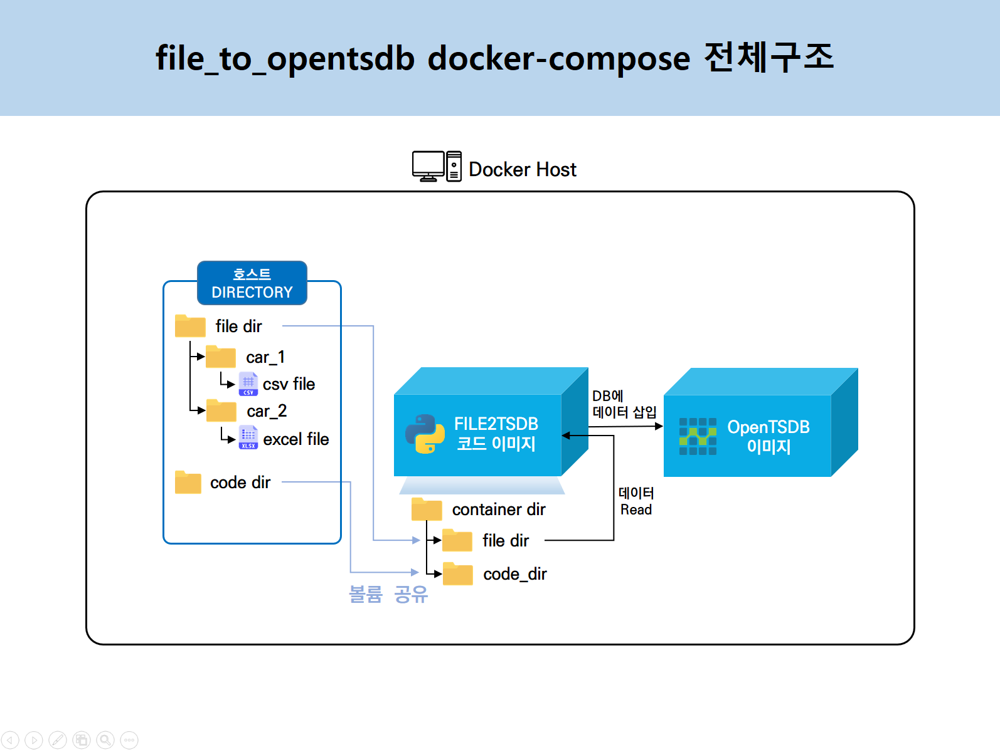
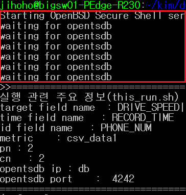
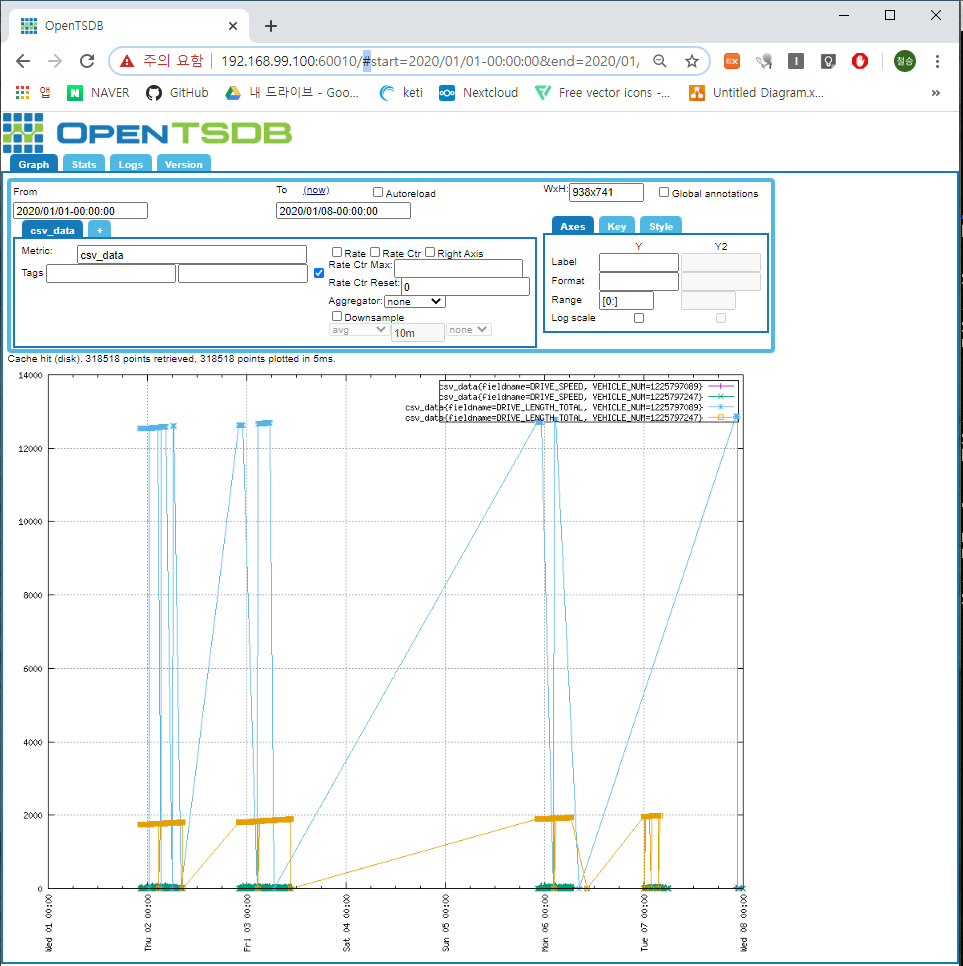
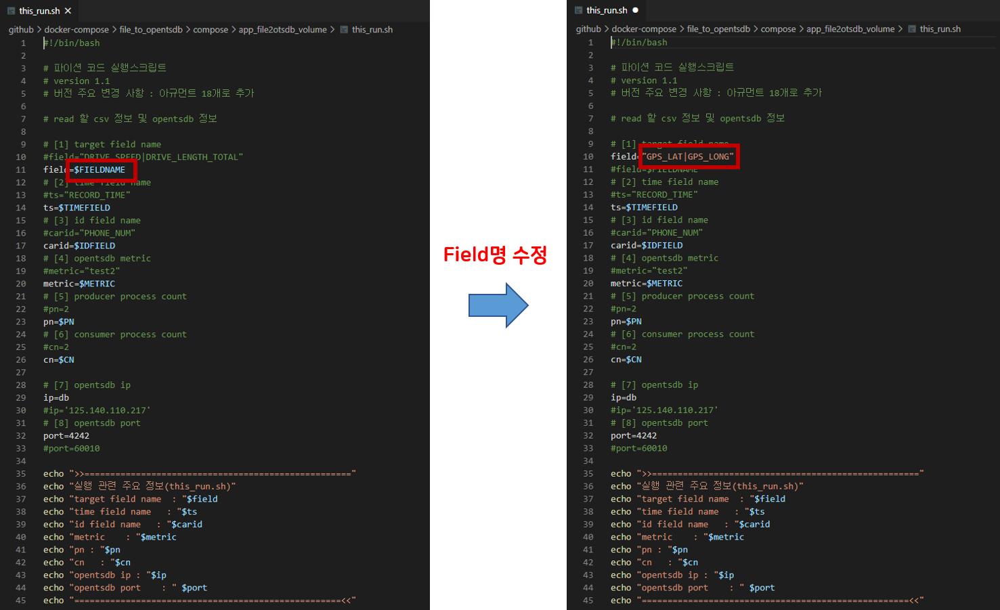

# file_to_opentsdb

특정 directory안의  csv, excel파일을 읽어 docker opentsdb container로 put하는 docker software

## file_to_tsdb 전체구조

  - 

## 사전준비
  1.  리눅스/우분투 docker/docker-compose 설치
  
      https://hcnam.tistory.com/25
      
  2. 윈도우
  
     - docker/docker-compose 설치
  
       https://steemit.com/kr/@mystarlight/docker
      
     - 도커 툴박스 설치

       https://github.com/docker/toolbox/releases

## 사용방법
  1. github repo clone 혹은 zip파일 다운로드
  
      - git clone
      
            $ git clone https://github.com/ChulseoungChae/KETI_docker_sw.git
        
        or
      
      - 아래링크에서 zip파일 다운로드 후 압축해제, 원하는 디렉토리로 
      
          [Link(https://github.com/ChulseoungChae/KETI_docker_sw/releases)](https://https://github.com/ChulseoungChae/KETI_docker_sw/releases)
      
  2. file_to_opentsdb compose 디렉토리로 이동
  
            $ cd KETI_docker_sw/file_to_opentsdb/compose/
  
  
  3. docker-compose.yml파일 수정(수정할 내용은 하단에 기재)

     ※ 아래 app_file2otsdb부분의 environment의 FIELDNAME, IDFIELD, TIMEFIELD는 꼭 파일에서 확인하고 입력 ※

     - 필수 수정부분 설명
        
        ```
        version: '3'

        services: 
            opentsdb:
              image: petergrace/opentsdb-docker:latest
              restart: always
              ports:
                  - "[웹접속을 위한 포트번호]:4242"
              #environment:
              #    - WAITSECS=30
              container_name: opentsdb_container

            app_file2otsdb:
              image: jihoho/file_to_otsdb:v2
              #container에 ssh 접속을 위해 로컬포트:컨테이너내부포트 포트포워딩
              ports:
                - "5004:22"
              volumes:
                - "./app_file2otsdb_volume:/app/FILE2TSDB/"
                - "./files:/app/files"
              environment:
                - FIELDNAME=[입력하려는 field name(여러개일경우 field사이에 '|'를 공백없이 입력)]
                - IDFIELD=[id field name]
                - TIMEFIELD=[시간 field name]
                - METRIC=[opentsdb metric 이름]
                - PN=2
                - CN=2
              container_name: file2otsdb_container
              # --link 옵션을 이용해 opentsdb container 와 link를 맺을 것을 설정한다. 
              # 이렇게 설정하면, file_to_opentsdb container 는 opentsdb container 를 IP 가 아닌 container의 이름을 이용해 통신할 수 있다.
              # file_to_opentsdb container의 /etc/hosts 파일에 opentsdb container의 IP 주소와 host명이 등록되어 있다.
              links:
                - opentsdb:db
        ```
        
     - ex)
        
        ```
        version: '3'

        services: 
            opentsdb:
              image: petergrace/opentsdb-docker:latest
              restart: always
              ports:
                  - "60010:4242"
              #environment:
              #    - WAITSECS=30
              container_name: opentsdb_container

            app_file2otsdb:
              image: jihoho/file_to_otsdb:v2
              #container에 ssh 접속을 위해 로컬포트:컨테이너내부포트 포트포워딩
              ports:
                - "5004:22"
              volumes:
                - "./app_file2otsdb_volume:/app/FILE2TSDB/"
                - "./files:/app/files"
              environment:
                - FIELDNAME=DRIVE_SPEED|DRIVE_LENGTH_TOTAL
                - IDFIELD=PHONE_NUM
                - TIMEFIELD=RECORD_TIME
                - METRIC=csv_data
                - PN=2
                - CN=2
              container_name: file2otsdb_container
              # --link 옵션을 이용해 opentsdb container 와 link를 맺을 것을 설정한다. 
              # 이렇게 설정하면, file_to_opentsdb container 는 opentsdb container 를 IP 가 아닌 container의 이름을 이용해 통신할 수 있다.
              # file_to_opentsdb container의 /etc/hosts 파일에 opentsdb container의 IP 주소와 host명이 등록되어 있다.
              links:
                - opentsdb:db
        ```

  4. docker-compose로 container 실행

        ```
        $ sudo docker-compose up -d # 모든 컨테이너 한번에 실행
        
        # 따로 실행
        $ sudo docker-compose up -d opentsdb # opentsdb 컨테이너 실행
        $ sudo docker-compose up -d app_file2otsdb # csv or xlsx data put 컨테이너 실행
        ```   
      - opentsdb 구동이 완료될때 까지 start.sh에서 3초마다 응답확인 하면서 대기, 완료 응답이 오면 코드 실행시킴 (보통 1분 안에 opentsdb 구동 완료됨)
        - 
        - 
        

  - file_to_opentsdb docker-compose 실행 화면
  
    - opentsdb 컨테이너 실행, 결과
    
      
    
    - file2tsdb 컨테이너 실행, 결과
    
      

## 컨테이너 실행 후 로그 확인
    $ sudo docker logs -f file2otsdb_container  # windows or linux 환경
    $ bash view_logs.sh # linux 환경

## wget으로 opentsdb에 입력된 데이터 확인
  - opentsdb 웹 접속하여 데이터 조회한 화면

      http://192.168.99.100:60010/#start=2020/01/01-00:00:00&end=2020/01/08-00:00:00&m=none:csv_data&o=&yrange=%5B0:%5D&wxh=938x741&style=linespoint

      

  - 위 화면에서 url의 '#'(드래그한 부분)을 'api/query?' 로 바꾸면 아래 사진과 같이 json형태로 데이터를 확인할 수 있음

      

    이 데이터를 리눅스터미널에서 wget을 이용하여 파일로 내려받을수 있다.
    
        $ wget 'http://[ip]:[port]/api/query?start=[데이터 시작날짜]&end=[데이터 끝날짜]:00&m=none:[metric_name]&o=&yrange=%5B0:%5D&wxh=938x741&style=linespoint' -O filename.txt
        
  - 테스트 화면
      

    
## 코드 수정 및 수정한 코드 실행(tsdb에 입력된 field이외에 다른 field를 추가로 입력할 때)
  1. 공유 디렉토리로 이동
  
         $ cd /KETI_docker_sw/file_to_opentsdb/compose/app_file2otsdb_volume

     

  2. code editor로 field name 변경(아래사진은 VScode editor사용)

     

  
  3. 수정한 코드가 적용된 docker container 재실행

         $ docker exec <컨테이너 name> bash /app/FILE2TSDB/this_run.sh   # windows or linux 환경
         $ bash file_input.sh # linux 환경

         


  4. opentsdb 웹에서 확인

     http://localhost:60010/#start=2020/01/01-00:00:00&end=2020/01/08-00:00:00&m=none:csv_data&o=&wxh=900x600&style=linespoint

       