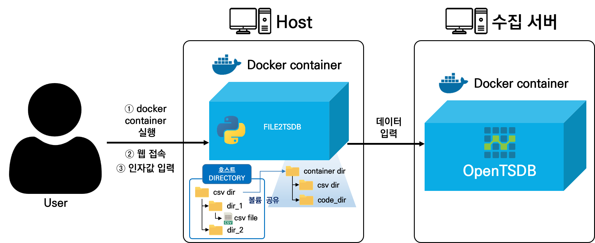
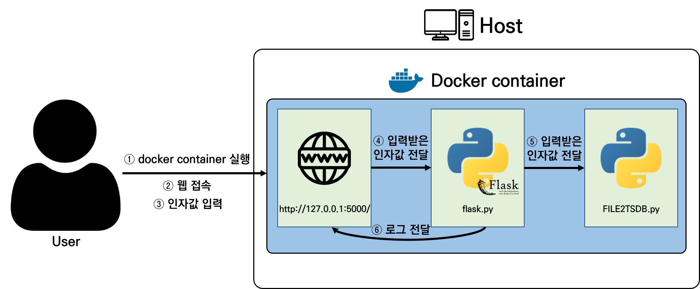
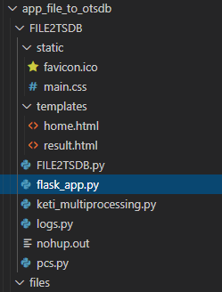
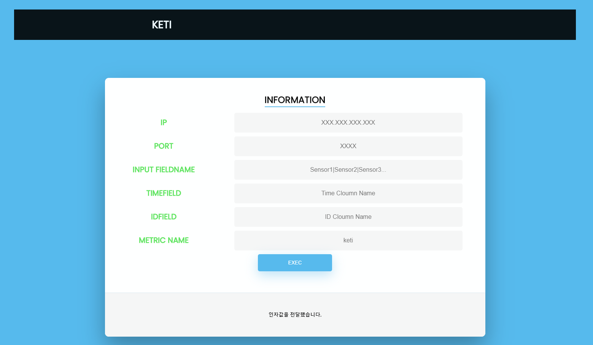
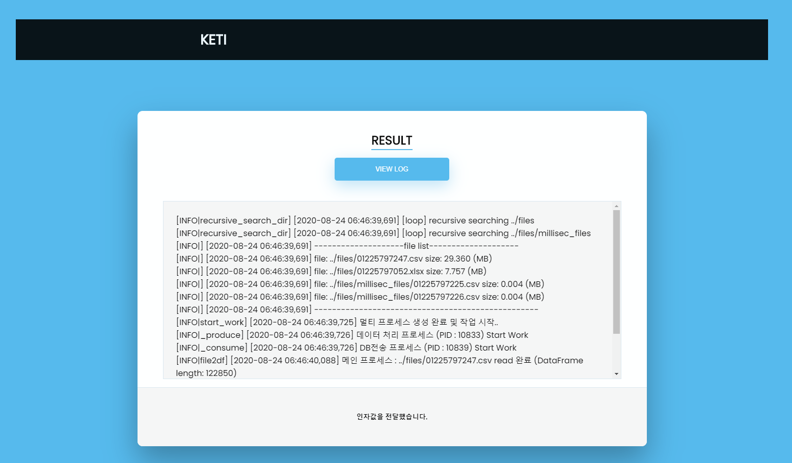
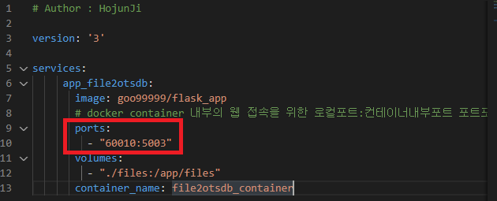
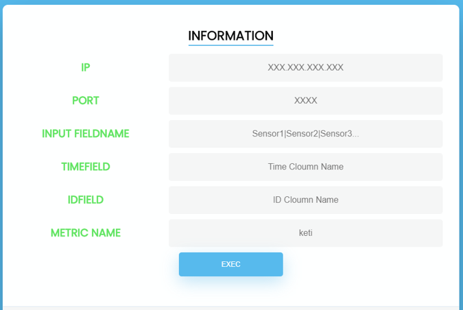
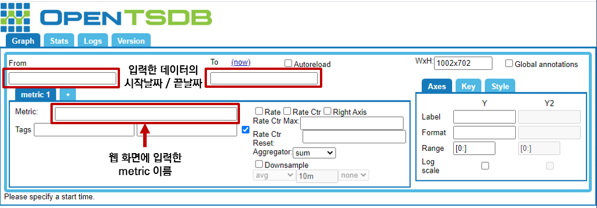

# [Flask] Read files and Put data to collection server database

----

## SW 전체 구조

  - SW 동작 구조도

    - 기능구조
      

        - CSV, Excel 원본 측정/수집 데이터를 다른 데이터 축적 서버의 OpenTSDB 로 전송하여 저장하는 Docker Container 구조의 S/W
        - OpenTSDB로 입력하고자 하는 데이터는 (로컬호스트 파일시스템에 위치)  
            - 전송, 저장을 위한 파일은 특정 directory안의 위치시킴
            - csv, excel파일 read하여  다른 데이터 축적 서버의 opentsdb로 put하는 python software
        - 원본 데이터, CSV파일 및 Excel파일을 다른 데이터 축적 서버의 OpenTSDB 컨테이너로 전송 및 저장

    - docker 컨테이너 내부 동작구조
      

        - Flask는 Python으로 구동되는 웹 어플리케이션 프레임워크이다. Django 프레임워크보다 가볍고, 스케일이 작은 서버부터 스케일 큰 서버를 만들 수가 있다. 개발하고자 하는 소프트웨어의 구조는 웹에서 인자값을 입력받아 전처리 python 소프트웨어에 인자값들을 전달하여 실행하고 python소프트웨어는 로그파일을 남겨 웹에서 로그파일을 읽어 실시간으로 출력하는 간단한 기능임으로 flask를 사용하였다.
        
        - 우선 docker 컨테이너 내부 디렉터리 구조를 보면 아래 사진과 같다.

            

          docker container를 실행하면 flask_app.py가 실행되고 웹 브라우져가 활성화된다. 브라우저 주소창에 도메인 URL을 타이핑하면 Flask는 templates 디렉토리에서 .html 템플릿을 찾고 HTML 페이지를 생성해 다시 브라우저로 보내는 방식으로 작동한다.

          웹페이지에 접속하면 아래와같이 인자값을 기입할 수 있는 창이 나온다. 

          

          각각의 칸에 인자값을 입력하고 아래의 EXEC버튼을 누르면 인자값들을 flask_app.py에서 전달받고 이 인자값들을 FILE2TSDB.py에 전달하면서 실행시키고 전처리 작업이 실행된다. 웹 페이지는 아래 사진과같이 로그를 실시간으로 볼 수 있는 페이지로 넘어가게된다. FILE2TSDB.py가 전처리작업을 진행하면서 로그파일을 생성하고 진행과정 메시지들을 로그파일에 append하는 방식으로 기록한다. 

          

----

## 사전준비

- Docker Desktop 및 docker-compose 실행 가능해야 함

  1.  리눅스/우분투 docker/docker-compose 설치
  
      https://hcnam.tistory.com/25
      
  2. 윈도우
  
     - docker/docker-compose 설치
  
       https://steemit.com/kr/@mystarlight/docker
      
     - 도커 툴박스 설치

       https://github.com/docker/toolbox/releases

----

## 사용방법

  1. github repo clone 혹은 zip파일 다운로드
  
      - git clone

            $ git clone https://github.com/ChulseoungChae/KETI_docker_sw.git
        
        or
      
      - 아래링크에서 원하는 디렉토리로 zip파일 다운로드 후 압축해제

          [Link(https://github.com/ChulseoungChae/KETI_docker_sw/releases)](https://github.com/ChulseoungChae/KETI_docker_sw/releases
)
      
  2. compose 디렉토리 이동 및 docker-compose.yml 파일 수정

        - compose 디렉토리로 이동

              $ cd KETI_docker_sw/file_to_opentsdb_v2/compose/ 

        - docker-compose.yml 파일에서 웹 접속할 포트번호 수정
          -  아래사진의 빨간네모박스 부분은 docker container 내부의 웹 포트를 로컬에서 접속할 웹 포트와 매칭시켜주는 것이다. 오른쪽 번호가 docker container 내부 웹접속 포트이고 왼쪽 번호가 로컬 웹에서 접속할 포트번호이다. 따라서 왼쪽 부분의 번호를 원하는 포트번호로 수정해주면 된다.

            
   
  3. 입력할 데이터 파일 위치

        - KETI_docker_sw/file_to_opentsdb/compose/files/ 디렉터리 안에 입력할 데이터 파일들을 위치시키면 된다.

  4. 도커 컨테이너 실행 및 구동 확인

     - docker-compose 실행
        
           $ docker-compose up -d 

     - 자신의 pc 혹은 서버의 브라우져에서 http://127.0.0.1:'docker-compose.yml파일에 쓰인 포트번호' 를 입력하면 아래와 같은 화면이 나옴.

       
       
        위 화면에서 각각의 인자값들을 기입하고 EXEC버튼을 누르면 공유폴더 이하의 파일들을 읽어 다른 축적서버의 OpenTSDB에 데이터를 입력하는 작업이 실행되고, 아래 사진과같이 로그를 실시간 확인할 수 있는 화면이 나타나서 작동 확인 가능.

       
       
----

## 웹 화면 각 파마리터 설명

  -  
 
  - IP
    - 데이터를 입력할 OpenTSDB의 url의  ip주소이다. 하나마이크론 서버의 TSDB에 입력할것이기 때문에 210.181.49.152를 입력하면 된다.
  - PORT
    - 데이터를 입력할 OpenTSDB의 url의 port번호이다. 하나마이크론 서버의 TSDB에 입력할것이기 때문에 60010를 입력하면 된다.
  - INPUT FIELDNAME
    - DB에 입력할 데이터의 column 이름이다. 여러 개일 경우 예시처럼 각 column중간에 ‘|’를 붙이면 된다
  - TIMESTAMP
    - DB에 입력할 데이터의 시간정보 field이름이다.
  - IDFIELD
    - DB에 입력할 데이터의 ID field이름이다. 예를들어 차량번호와같이 구분되어진 field가 있다면 입력하고 없으면 none이라고 입력하면 된다. 
  - METRIC NAME
    - 데이터가 쓰여질 metric 이름이다. 다른 데이터베이스의 table과 같은 개념이다.

----

## 데이터베이스에 데이터 입력 확인

  1. 하나마이크론서버에 설치된 OpenTSDB 웹 접속

      - http://210.181.49.152:60010/ 

  2. 데이터 조회

      - 먼저 입력한 데이터의 처음과 마지막 날짜를 입력한 후, 웹화면에 입력한 metric이름을 입력하면 데이터가 그래프형태로 보여진다
      
       
